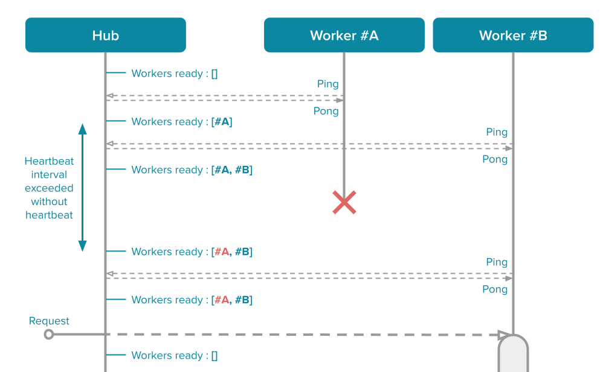

# Architecture

!!! warning
    This page contains advanced technical details about `gibbs`. You can probably skip it if you just want to use the library.

## Tooling

`gibbs` relies on the `zmq` library for communication between the hub and the workers.

`zmq` is a low-level networking library, providing us with TCP sockets. This gives us performances, and the ability to have workers on different machines.

## Pattern

`gibbs` implement a modified version of the ***Paranoid Pirate Pattern***.

You can read more about the Paranoid Pirate Pattern in the [zmq guide](https://zguide.zeromq.org/docs/chapter4/#Robust-Reliable-Queuing-Paranoid-Pirate-Pattern). But basically :

* It is a **reliable** pattern (it can handle failures)
* It relies on the *REQUEST - REPLY* sockets (and their asynchronous equivalent : *ROUTER - DEALER*)
* It automatically balance requests across workers as they come

---

Here is a schema for the Paranoid Pirate Pattern implemented in `gibbs` :

!!! tip
    As you can see the the original Paranoid Pirate Pattern is slightly modified : the clients and the queue are merged into a single component, called "Hub".

---

Let's see how these components interact with each other to deal with parallel requests :

The Hub simply keeps a list of workers that are ready, and send incoming requests to one of the ready worker.

Each worker deal with the request it receives. So with two workers, we can deal with two requests in parallel, as shown in the figure above.

When receiving the response from the worker, the Hub marks it as ready again.

## Heartbeat

In the [zmq guide](https://zguide.zeromq.org/docs/chapter4/#Heartbeating-for-Paranoid-Pirate), the Paranoid Pirate Pattern implements a _One-way heartbeat_.

In `gibbs` though, the heartbeat is implemented as a _Ping-pong heartbeat_.

!!! question
    Heartbeat is necessary to have _robustness_, in case of workers or Hub crash.

---

Here is how heartbeat works :

The workers always initiate the heartbeat (_ping_), and the hub answer it (_pong_).

If the worker keeps sending pings but does not receive pongs, we know the Hub is dead. In this case the worker will try to reconnect his socket. So when the Hub is restarted, the worker will automatically reconnect.

If the Hub didn't receive a heartbeat from some time, we know this worker is dead. In this case the worker is removed from the list of workers ready, so no requests are sent to this worker.

!!! warning
    There is a small time interval where a worker can die and the Hub still thinks it's alive. If a request is sent in this interval, the request will fail. To solve this, you can check the [section about automatic retrials](advanced.md#retrials-timeouts).

## Graceful termination

In `gibbs`, the workers terminate cleanly when interrupted with a `CTRL-C` or another signal such as `SIGTERM`. By default, these signals simply kill the process, but in our case this is detrimental : if the worker took a request, we want this request to be _fully_ treated, otherwise it is lost.

If a worker took a request and then receive a signal to shut down, it will first process the request and send back the response before shutting down.

!!! tip
    If you don't want your worker to end gracefully, you can always send a `SIGKILL`.

To have this feature, the workers uses another socket internally, and uses polling to get whatever comes first (request or termination signal) :

So if a request comes first, the worker will first deal with the request before dealing with the termination signal (shutting down).
